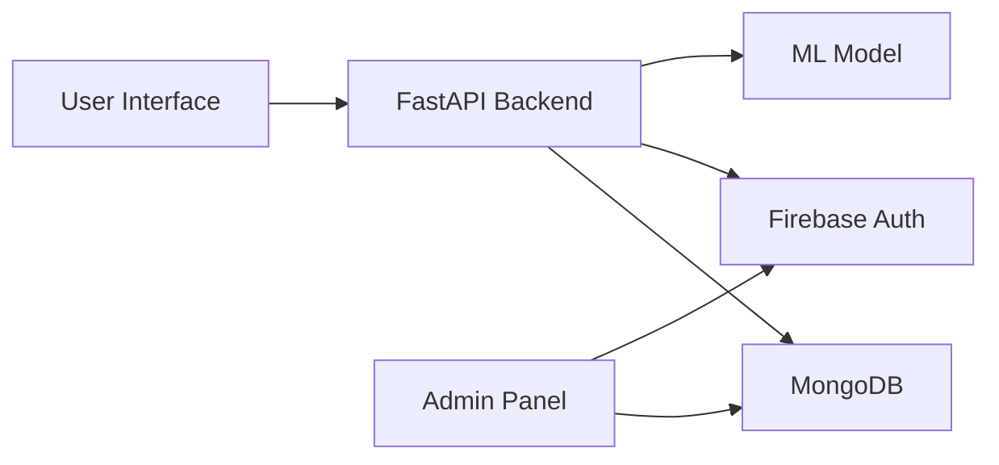

# 🖋️ Signature Verification & Attendance Management System

[](https://www.python.org/)
[](https://fastapi.tiangolo.com/)
[](https://reactjs.org/)
[](https://streamlit.io/)
[](https://www.mongodb.com/)
[](https://firebase.google.com/)

## 📋 Table of Contents
- [Overview](#-overview)
- [Features](#-features)
- [Architecture](#-architecture)
- [Installation](#-installation)
- [Usage](#-usage)
- [API Documentation](#-api-documentation)
- [Model Performance](#-model-performance)
- [Screenshots](#-screenshots)
- [Contributing](#-contributing)
- [License](#-license)

## 🎯 Overview
An advanced signature verification system integrated with attendance management, powered by deep learning and modern web technologies. The system provides real-time signature authentication and comprehensive attendance tracking capabilities.

### Key Components
1. 🤖 Deep Learning Signature Verification
2. 🎛️ Admin Dashboard (Streamlit)
3. 🌐 User Interface (React + FastAPI)

## ✨ Features

### Signature Verification Model
- 🧠 Advanced CNN Architecture
- 📊 87% Accuracy Rate
- 🔄 Real-time Processing
- 📈 Performance Monitoring

### Admin Panel
- 🔐 Secure Authentication
- 📚 Course Management
- 👥 Student Tracking
- 📊 Analytics Dashboard

### User Interface
- ⚡ Real-time Updates
- 📱 Responsive Design
- 📊 Interactive Charts
- 🖋️ Signature Upload

## 🏗️ Architecture

### System Architecture


## 🧠 Model Architecture Details

### CNN Architecture
```ascii
Input (128x128, grayscale)
    ↓
Conv2D (32 filters) + ReLU
    ↓
BatchNorm + MaxPool + Dropout(0.3)
    ↓
Conv2D (64 filters) + ReLU
    ↓
BatchNorm + MaxPool + Dropout(0.3)
    ↓
Dense (128) + ReLU
    ↓
Output (Sigmoid)
```

